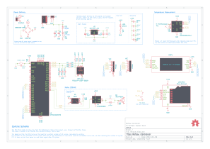

# Reflow
This is a reflow oven controller based on ideas from ReflowMaster and is intended to work with a kitchen style toaster oven, but can also be adapted to a quartz heater or halogen lamp hack.

### Control Scheme
The MCU first needs to know how fast the temperature rises at full power, as a measure of thermal mass. This value is stored in an internal non-volatile memory.

The based on this, the MCU turns on the load for a certain number of AC cycles, calculated by scaling the duration of the calibration to 10 cycles. After this if the temperature is more than what the calibration curve was, we start reducing the number of cycles. If it is less, we just turn power on and check again after 10 cycles.

This is not a particularly refined or accurate scheme yet, mainly due to my decision to forego having mains voltages on this board and control using SCR phase control.

## Changes from ReflowMaster
I've based this on a more readily available UC3B AVR32 chip rather than an ARM M0 based SAM D21 chip which I think is slightly overkill for something simple like this. 
This could easily be done even with an 8-bit AVR MCU but I chose a 32-bit one simply because of the inbuild USB, preinstalled DFU bootloader, multiple external interrupts, and ease of programming a UI.

## Important Application Notes
http://ww1.microchip.com/downloads/en/devicedoc/doc7745.pdf

## MarcoReps's JBC Station
Marco made a soldering station and used a zero-crossing switching scheme for temperature control. It is very much worth looking at this and improving.
https://www.youtube.com/watch?v=cYgjcDbSyRE
